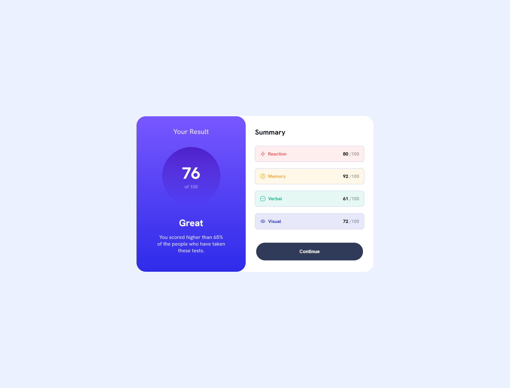
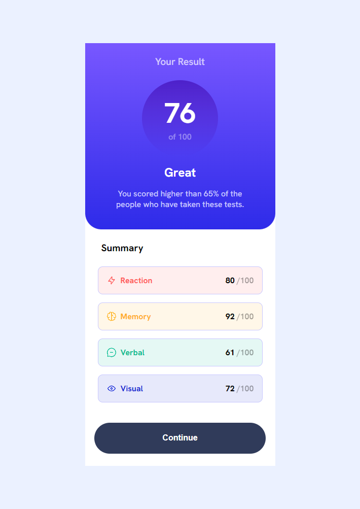

# Frontend Mentor - Results summary component solution

This is a solution to the [Results summary component challenge on Frontend Mentor](https://www.frontendmentor.io/challenges/results-summary-component-CE_K6s0maV). Frontend Mentor challenges help you improve your coding skills by building realistic projects. 

## Table of contents

- [Overview](#overview)
  - [The challenge](#the-challenge)
  - [Screenshot](#screenshot)
  - [Links](#links)
- [My process](#my-process)
  - [Built with](#built-with)
  - [What I learned](#what-i-learned)
  - [Continued development](#continued-development)
  - [Useful resources](#useful-resources)
- [Author](#author)
- [Acknowledgments](#acknowledgments)

**Note: Delete this note and update the table of contents based on what sections you keep.**

## Overview

### The challenge

Users should be able to:

- View the optimal layout for the interface depending on their device's screen size
- See hover and focus states for all interactive elements on the page

### Screenshot

The dekstop version

The mobile version

### Links

- Solution URL: [Add solution URL here](https://your-solution-url.com)
- Live Site URL: [Add live site URL here](https://your-live-site-url.com)

## My process

When I was creating this project, I made sure to structure my content with HTML before adding any styles. This helped me to focus on creating well-organized and easily readable content.

By starting with HTML, I was able to create a logical structure for my content using headings, paragraphs, and other elements. After creating the HTML structure, I started adding base styles to my project. For general content styles, I set the font-family a font like "Hanken Grotesk" and default 'sans-serif'.

I began adding styles to the top of the page, I added a background color and set the font-size and font-weight for the projects titles and paragraphs. I then moved on to the main content area, where I set the color of the text and added some width to give the content some breathing room.

By taking a systematic approach to adding styles, I was able to ensure that my project looked polished and professional while remaining well-organized and easily readable.

### Built with

- Semantic HTML5 markup
- CSS custom properties
- Flexbox
- Mobile-first workflow

### Continued development

Looking towards the future, I am eager to expand my knowledge and skills in both styling and programming, and have set my sights on learning JavaScript. My aim is to deepen my understanding of this powerful language and apply it to create more dynamic and interactive projects.

In addition to learning JavaScript, I am also keen to explore various frameworks to further enhance my skills. By working with frameworks, I hope to gain a deeper understanding of their unique features and functionalities, and ultimately improve my overall proficiency in front-end development.

I am excited about the possibilities that lie ahead and look forward to pushing my boundaries to create more advanced and sophisticated projects.

## Author

- GitHub - [Ioan Gheraszim](https://github.com/ioangheraszim)
- Frontend Mentor - [@yourusername](https://www.frontendmentor.io/profile/ioangheraszim)
